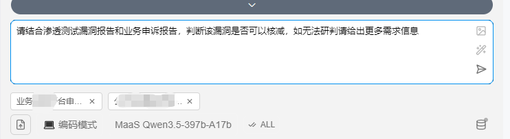
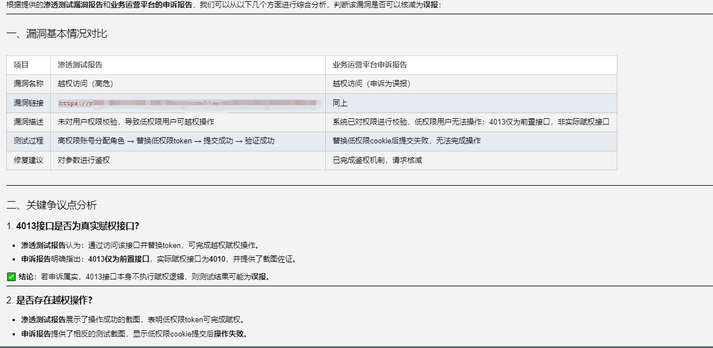
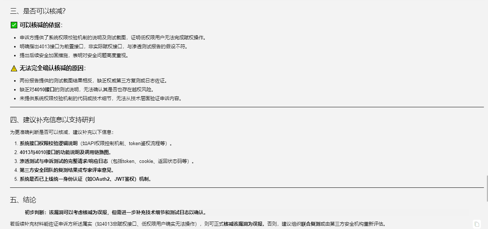

# 漏洞核减判断专家（vulnerability-reduction）

---

专门处理人工检测报告的漏洞申诉评估，当用户提到"漏洞核减"、"漏洞能降级吗"、"这个漏洞是误报"、"漏洞风险评估"、"漏洞申诉"时必须使用。评估人工检测漏洞的真实风险，结合内外网环境、检出等级、实际危害等因素输出可追溯的研判结论。强烈建议在收到人工检测报告或开发团队申诉时主动调用此技能。
version: 0.0.1
author: 骑虎牧羊
compatibility: ["references/附件：常见漏洞分类分级表20250530.xlsx"]

---

# HOW TO USE

0x01 你说：请结合渗透测试漏洞报告和业务申诉报告，判断该漏洞是否可以核减，如无法研判请给出更多需求信息

0x02 上传漏洞检测报告、漏洞申诉报告

0x03 wanma回复

